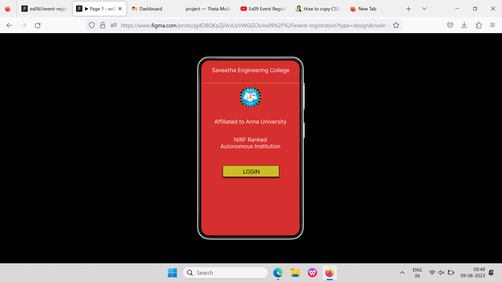
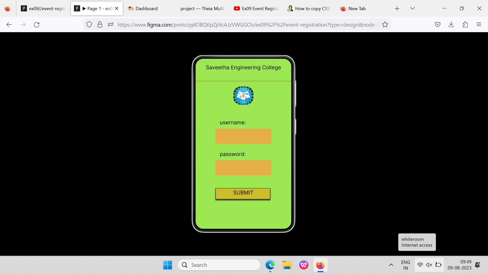
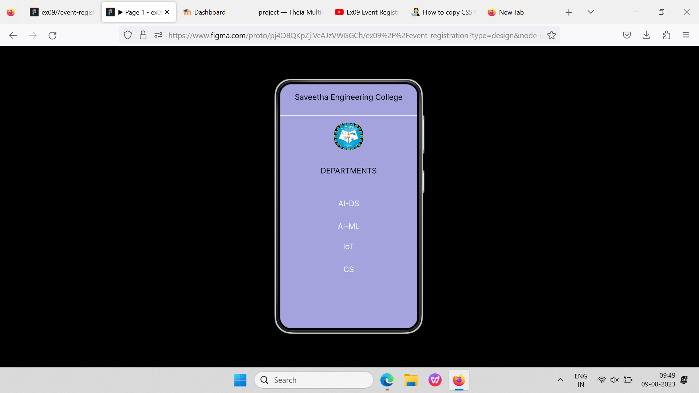

# Event Registration Web Application

## AIM:
To design, develop and deploy a web application for event registration.

## DESIGN STEPS:

### Step 1:

Create a new frame.

### Step 2:

Select any one preset size of your choice.

### Step 3:

Select the shapes you need.

### Step 4:

Import images as needed.

### Step 5:

Create pages based on your need and link them

### Step 6:

Validate the HTML and CSS code.

### Step 6:

Publish the website in the given URL.

## DESIGN TOOL:

Figma

## PROGRAM :
```
/* Home Page */
position: relative;
width: 360px;
height: 640px;
background: #D62F2F;

/* Saveetha Engineering College */
position: absolute;
width: 318px;
height: 53px;
left: 22px;
top: 24px;
font-family: 'Inter';
font-style: normal;
font-weight: 400;
font-size: 20px;
line-height: 24px;
text-align: center;
color: #FFFFFF;

/* Affiliated to Anna University */
position: absolute;
width: 318px;
height: 53px;
left: 21px;
top: 212px;
font-family: 'Inter';
font-style: normal;
font-weight: 400;
font-size: 20px;
line-height: 24px;
text-align: center;
color: #FFFFFF;

/* NIRF Ranked Autonomous Institution */
position: absolute;
width: 318px;
height: 53px;
left: 21px;
top: 278px;
font-family: 'Inter';
font-style: normal;
font-weight: 400;
font-size: 20px;
line-height: 24px;
text-align: center;
color: #FFFFFF;

/* Line 1 */
position: absolute;
width: 360px;
height: 0px;
left: 0px;
top: 84px;
border: 1px solid #CEBD2A;

/* lo-go 1 */
position: absolute;
width: 74.9px;
height: 68.95px;
left: 142.73px;
top: 99px;
background: url(lo-go), url(lo-go);
border-radius: 29px;
transform: rotate(0.6deg);

/* Rectangle 1 */
box-sizing: border-box;
position: absolute;
width: 206px;
height: 42px;
left: 79px;
top: 384px;
background: #CEBD2A;
border: 1px solid #000000;
box-shadow: 0px 4px 4px rgba(0, 0, 0, 0.25), 0px 4px 4px rgba(0, 0, 0, 0.25), 0px 4px 4px rgba(0, 0, 0, 0.25), 0px 4px 4px rgba(0, 0, 0, 0.25);

/* LOGIN */
position: absolute;
width: 175px;
height: 31px;
left: 96px;
top: 395px;
font-family: 'Inter';
font-style: normal;
font-weight: 400;
font-size: 20px;
line-height: 24px;
text-align: center;
color: #000000;


/* Login Page */
position: relative;
width: 360px;
height: 640px;
background: #9DE752;

/* Saveetha Engineering College */
position: absolute;
width: 318px;
height: 53px;
left: 21px;
top: 21px;
font-family: 'Inter';
font-style: normal;
font-weight: 400;
font-size: 20px;
line-height: 24px;
text-align: center;
color: #000000;

/* Line 2 */
position: absolute;
width: 360px;
height: 0px;
left: 0px;
top: 84.5px;
border: 1px solid #D62F2F;

/* lo-go 2 */
position: absolute;
width: 74.9px;
height: 68.95px;
left: 142.73px;
top: 104px;
background: url(lo-go), url(lo-go), url(lo-go);
border-radius: 29px;
transform: rotate(0.6deg);

/* Rectangle 2 */
position: absolute;
width: 210px;
height: 57px;
left: 75px;
top: 263px;
background: #E6AF45;

/* Rectangle 3 */
position: absolute;
width: 210px;
height: 57px;
left: 75px;
top: 382px;
background: #E6AF45;

/* username: */
position: absolute;
width: 140px;
height: 23px;
left: 91px;
top: 228px;
font-family: 'Inter';
font-style: normal;
font-weight: 400;
font-size: 20px;
line-height: 24px;
color: #000000;

/* password: */
position: absolute;
width: 140px;
height: 23px;
left: 91px;
top: 347px;
font-family: 'Inter';
font-style: normal;
font-weight: 400;
font-size: 20px;
line-height: 24px;
color: #000000;

/* Rectangle 2 */
box-sizing: border-box;
position: absolute;
width: 206px;
height: 42px;
left: 75px;
top: 487px;
background: #CEBD2A;
border: 1px solid #000000;
box-shadow: 0px 4px 4px rgba(0, 0, 0, 0.25), 0px 4px 4px rgba(0, 0, 0, 0.25), 0px 4px 4px rgba(0, 0, 0, 0.25), 0px 4px 4px rgba(0, 0, 0, 0.25);

/* SUBMIT */
position: absolute;
width: 175px;
height: 31px;
left: 92px;
top: 492px;
font-family: 'Inter';
font-style: normal;
font-weight: 400;
font-size: 20px;
line-height: 24px;
text-align: center;
color: #000000;


/* SEC Page */
position: relative;
width: 360px;
height: 640px;
background: #A4A3DE;

/* Saveetha Engineering College */
position: absolute;
width: 318px;
height: 53px;
left: 21px;
top: 22px;
font-family: 'Inter';
font-style: normal;
font-weight: 400;
font-size: 20px;
line-height: 24px;
text-align: center;
color: #000000;

/* Line 3 */
position: absolute;
width: 360px;
height: 0px;
left: 0px;
top: 82px;
border: 1px solid #FFFFFF;

/* lo-go 3 */
position: absolute;
width: 74.9px;
height: 68.95px;
left: 142.73px;
top: 102px;
background: url(lo-go), url(lo-go), url(lo-go);
border-radius: 29px;
transform: rotate(0.6deg);

/* DEPARTMENTS */
position: absolute;
width: 318px;
height: 53px;
left: 21px;
top: 215px;
font-family: 'Inter';
font-style: normal;
font-weight: 400;
font-size: 20px;
line-height: 24px;
text-align: center;
color: #000000;

/* AI-DS */
position: absolute;
width: 318px;
height: 53px;
left: 21px;
top: 301px;
font-family: 'Inter';
font-style: normal;
font-weight: 400;
font-size: 20px;
line-height: 24px;
text-align: center;
color: #FFFFFF;

/* AI-ML */
position: absolute;
width: 318px;
height: 53px;
left: 21px;
top: 361px;
font-family: 'Inter';
font-style: normal;
font-weight: 400;
font-size: 20px;
line-height: 24px;
text-align: center;
color: #FFFFFF;

/* IoT */
position: absolute;
width: 318px;
height: 53px;
left: 21px;
top: 414px;
font-family: 'Inter';
font-style: normal;
font-weight: 400;
font-size: 20px;
line-height: 24px;
text-align: center;
color: #FFFFFF;

/* CS */
position: absolute;
width: 318px;
height: 53px;
left: 21px;
top: 474px;
font-family: 'Inter';
font-style: normal;
font-weight: 400;
font-size: 20px;
line-height: 24px;
text-align: center;
color: #FFFFFF;
```

## OUTPUT:





## Result:

The program to design, develop and deploy a web application for event registration is completed successfully.